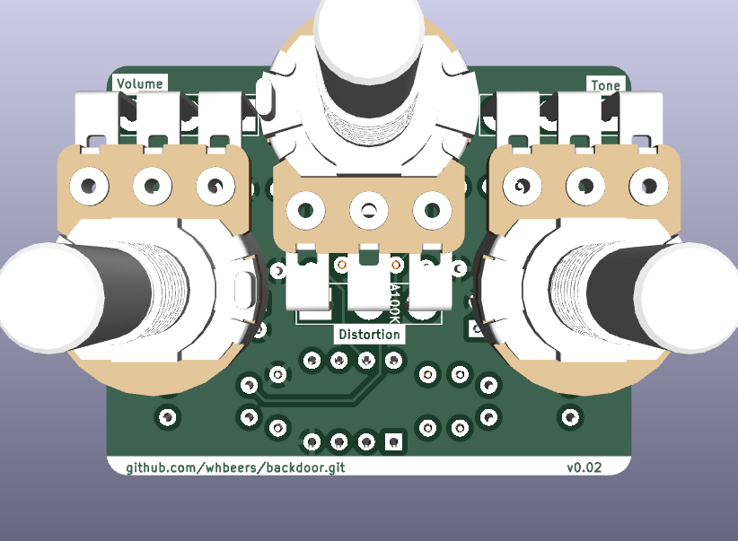

# Backdoor Distortion Effect

This is my take on the ProCo "Rat" distortion effect, designed in [KiCAD](https://www.kicad.org/).  The design is initially based on widely available schematics, but tweaked while building it out on a breadboard with my daughter. (She was involved in every stage of the development of this effect, and learned a ton!)

The board is built on the ["Noise Floor"](https://github.com/whbeers/noise_floor) pedal platform, which provides basic power protection, audio IO, and a footswitch with LED indicator.

[Schematic PDF](schematics/backdoor-latest.pdf)

## Credit

I based the initial breadboarding on the ProCo Rat Analysis at [Electrosmash](https://www.electrosmash.com/proco-rat).

The Rat has a really interesting history - to learn more about it I recommend the [JHS Show episode on the subject](https://www.youtube.com/watch?v=QfwpClT_26E), and for more circuit analysis Brian Wampler has published [several](https://www.youtube.com/watch?v=zBGKdnlh4Ws) [youtube](https://www.youtube.com/watch?v=IAt-hgqrocI) [videos](https://www.youtube.com/watch?v=U2ZOTbfAcNs) going over the circuit and potential tweaks, including their own (tweaked) clone.

Thanks also to [Vasily Kashirin](https://grabcad.com/vasily.kashirin-1) for the awesome step models for potentiometers and jacks, and to folks on the [freestompboxes.org](https://www.freestompboxes.org/) forum for feedback and suggestions!

## Versioning

My pcb designs utilize the following versioning scheme (I'll add to this as I produce more revisions):
 - v0.0XX: A candidate design that has not yet been produced and tested.
 - v0.XX: A design that has been produced, tested, and any initial errors addressed.

## Name
*The name "Backdoor" is a reflection of the nature of the effect (a RAT) and security nerdery.*
